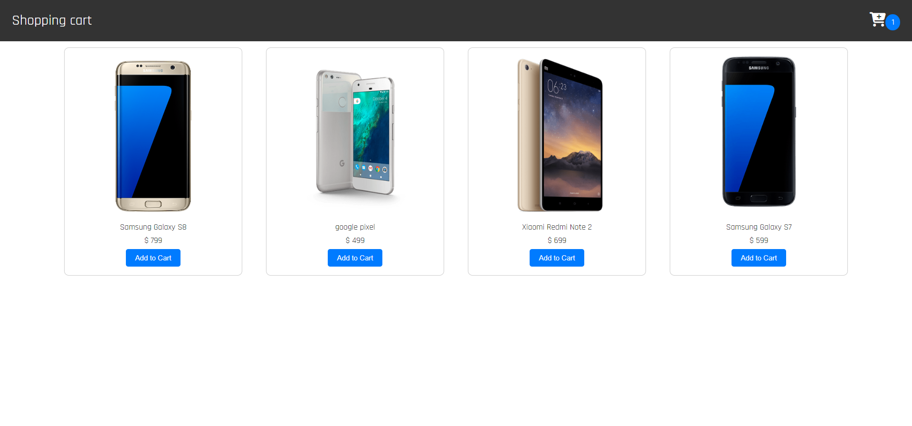

# Shopping Cart

## Table of Contents

- [Links](#links)
- [Description](#description)
- [Screenshot](#screenshot)
- [Demo](#demo)
- [Features](#features)
- [Technologies Used](#technologies-used)
- [Usage](#usage)
- [What I Learned](#what-i-learned)
- [Contributing](#contributing)

## Links

- Solution URL: [GitHub Repository](https://github.com/aruntutter/shopping-cart)
- Live Demo: [Live Demo URL](https://creative-sundae-e9b64b.netlify.app/)

## Description

The Shopping Cart project is a React-based application that enables users to add products to their cart, view the cart icon updating with each added product, and manage the quantity of items in the cart. The application also performs real-time total calculations for added items.

## Screenshots

Home

Cart

## Demo

Explore the live demo: [Here](https://creative-sundae-e9b64b.netlify.app/)

## Features

- Add products to the cart
- Cart icon dynamically updates with the number of added products
- Adjust the quantity of items in the cart
- Real-time total calculation for the items in the cart

## Technologies Used

- HTML
- CSS
- JavaScript
- React.Js

## Usage

To use the shopping cart application, follow these steps:

1. Visit the live demo [here](https://creative-sundae-e9b64b.netlify.app/).
2. Browse through the available products and click "Add to Cart" to add items to your cart.
3. Observe the cart icon updating with the number of added products.
4. Click on the cart icon to view and manage the items in your cart.
5. Adjust the quantity of items as needed, and the total will be calculated in real-time.

## What I Learned

While working on this project, I gained insights into:

- React components and state management
- Dynamic updating of UI elements
- Handling user interactions in a React application

## Contributing

Contributions are welcome! Feel free to open issues or submit pull requests to improve the project.
